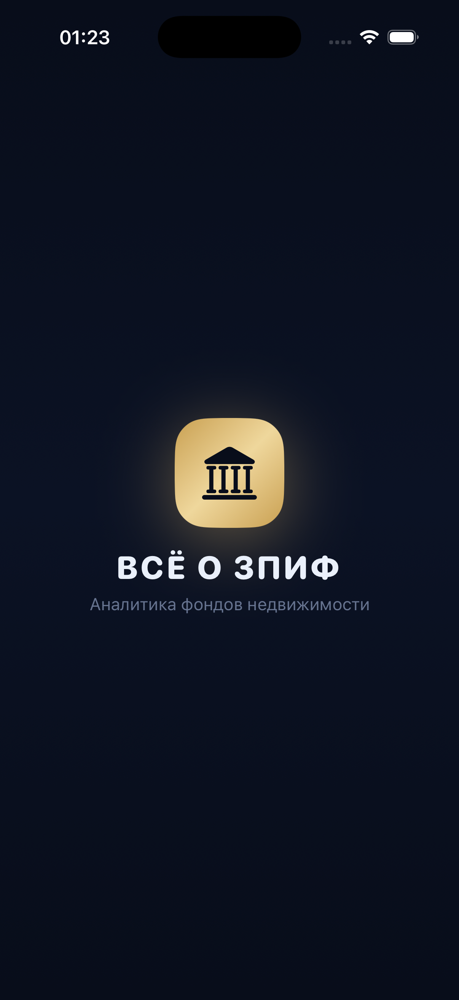
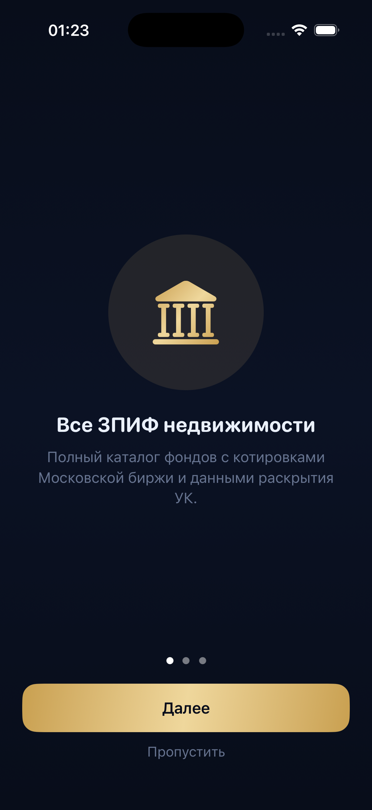
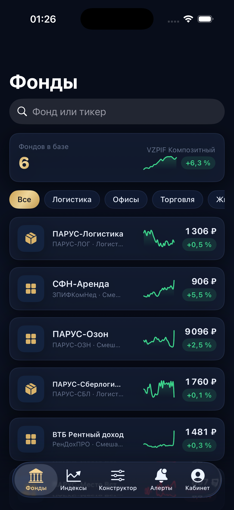

# Vsezpif iOS

**Premium SwiftUI showcase application for Russian real estate investment funds (ЗПИФ).**

Native iOS companion to the [vsezpif web platform](https://github.com/vreklameblogers-max/Vsezpif) · Live web demo: [vsezpif.pages.dev](https://vsezpif.pages.dev)

<p align="center">
  
  
  
</p>

## Features

- 📊 **Fund catalog** — live-looking cards with sparklines, search and segment filters
- 📈 **Fund details** — 90-day price chart (Swift Charts), key metrics grid
- 🧮 **Portfolio constructor** — investment amount slider, live yield calculation
- 🔔 **Price alerts** — toggleable alerts with creation sheet, notification channels
- 💼 **Personal account** — portfolio value, allocation donut chart, payout calendar
- 📉 **Proprietary VZPIF indices** — composite, rental and growth
- ✨ Glass cards (ultraThinMaterial), gradients, haptic feedback, skeleton loading, pull-to-refresh

## Stack

| | |
|---|---|
| UI | SwiftUI, NavigationStack, SF Symbols |
| Charts | Swift Charts (line, area, sector) |
| State | `@Observable` (iOS 17+) |
| Data | Local JSON snapshot — **zero network code** |
| Project | Hand-crafted `pbxproj`, folder-synchronized (Xcode 16+) |

## Architecture

```
Views  →  AppState (@Observable)  →  FundsProviding (protocol)  →  MockRepository  →  funds.json
```

The data layer is a single protocol. When the real REST API ships, `MockRepository`
is replaced by `ApiRepository` at one injection point (`AppState.init`) — **no screen changes**.

## Data honesty

Fund names, tickers, ISINs and last prices are a **real MOEX ISS snapshot**.
Everything derived (price history, yields, NAV) is **demo data**, generated
deterministically from ISIN and clearly labeled inside the app.

## Run

```bash
git clone https://github.com/vreklameblogers-max/vsezpif-ios.git
open vsezpif-ios/Vsezpif.xcodeproj
```

Select any iPhone Simulator → **⌘R**. No signing, no dependencies, no configuration.

Requirements: Xcode 16+, iOS 17+ simulator.

## Status

🟢 **Showcase** — built for investor and client demos. Not App Store-ready by design:
no app icon, no signing team, no privacy manifest. Planned next (visual-only iteration):
app icon, launch screen, TestFlight build, demo video.

## License

[MIT](LICENSE)
